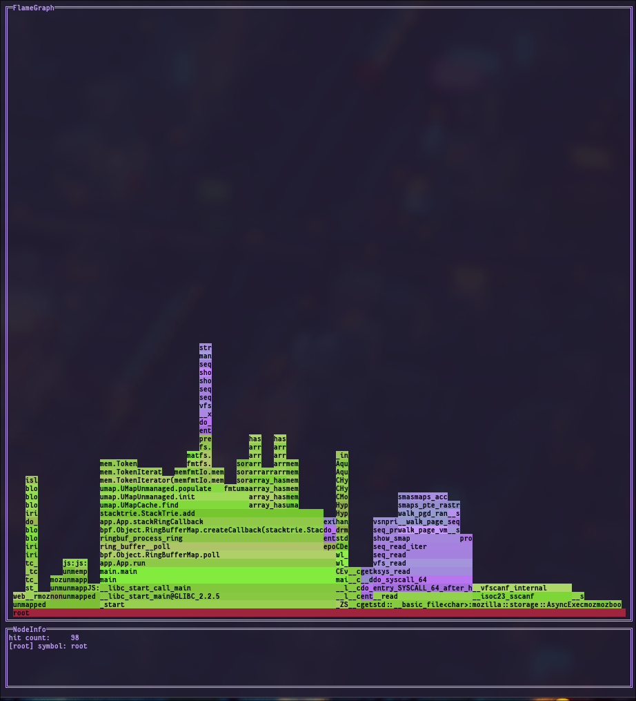

# flametui 



This repository presents **flametui**, an experimental Linux system profiler that attempts to visualize stack traces as flamegraphs in the terminal. 
The fun part of this project is that it draws a flamegraph, in the TUI! 
This tool uses eBPF to hook into the Linux kernel's `perf_event` subsystem, sampling stack traces across CPUs. 
It tries to aggregate these traces in userspace and resolve them to human-readable symbols for visualization. 

The origin story is that I always found it a bit annoying to have to install a bunch of different tools to get a flamegraph. 
Thus, this tool aims to provide an all-in-one solution: being able to measure and visualize in one go!

As a general disclaimer, this project is / was a huge learning experience for me, and written largely for my own enjoyment.
This project has been insufficiently scrutenized to take its outputs as serious and correct. 
It looks cool though!

I hope to keep the motivation to keep pushing it forward, trying to be somewhat neat in the versioning.
Currently, it is in a dodgy state, so we are still in **ALPHA**. 

## Usage

As `vaxis` pins `0.15.1`, this is the required version. Note that we supply a flake.nix such that you can use my 
exact zig version if you care to!

```bash
# Build the project
zig build -Doptimize=ReleaseFast

# Run the profiler (requires root/CAP_BPF privileges)
# Sample at 49Hz for 1 second
sudo zig-out/bin/flametui fixed --hz 49 --ms 1000

# Aggregate indefinitely — streams results to TUI, never evicts
sudo zig-out/bin/flametui aggregate --hz 49

# Sliding window — keeps the last N time slots, evicts oldest
sudo zig-out/bin/flametui ring --hz 49 --ms 50 --n 10
```

If you dont want to use my profiler (I must admit it is janky), you can also try doing something like:
```bash
# Get the tools (normally the slighly annoying part)
git clone https://github.com/brendangregg/FlameGraph

# Record + collapse stack traces
sudo perf record -F 99 -a -g -- sleep 5
sudo perf script | ./FlameGraph/stackcollapse-perf.pl > out.collapsed

# Plot them in the TUI!!
# NOTE: this records the number of cycles rather than the hit count, but the app still works
zig-out/bin/flametui file out.collapsed
```

Note that you can **click on the nodes** to expand the view! You can also navigate with keyboard:
**hjkl** / **WASD** / **arrow keys** to move, **Enter** to zoom in, **Escape** to unzoom, **q** to quit.

All profiling commands also accept `--verbose` for debug logging and `--enable-idle` to include idle (pid 0) samples.

*Note: Profiling requires root privileges...!*

## Future Roadmap / Ideas

There are several areas where this project could be improved:

- [ ] **Write Existing Formats**: 
        If for some arcane reason someone wants to serialize their measurement, we should
        Allow that. So I should also be able to EXPORT to collapsed stacktraces for example :)
- [ ] **Help Menu**: 
        To see what the keybindings are. Not important currently, cause I dont have keybindings.
- [ ] **Lifecycle Improvements**: 
        PIDs die, PIDs are born. We don't track that, so a PID can die, and come back and
        our current caching mechanism just gets it wrong... Fix this, potentially by tracking some more things in bpf.
- [ ] **Tests**: 
        I love tests, but I have zero. Fix this, testing as much as is reasonable.
- [ ] **Off-CPU**: 
        I want to make off-cpu flamegraphs too, this seems kind of useful.
    - [ ] mode=offcpu, mode=cpu, etc. CLI arguments
- [ ] **More Flamegraphs!!**: 
        I'm sure I can cook harder now that I have the basics down
- [ ] **Filtering**:
        Specific PID, run on a specified executable 
- [ ] **Vendoring as Library**:
        Plug into build.zig to have an e.g. `zig build profile` step.
- [ ] **Verification versus perf + flamegraph.pl**:
        Our program SHOULD give the same result, ensure that this is true.
- [ ] **Improved error Handling**:
        Currently we have `UNMAPPED` as our only indication, we can be more robust.
- [ ] **CI/CD for Release**:
        Currently, you gotta build. This sucks, I can just vendor for all major platforms.

## AI Usage Disclaimer
More or less all code was hand-written, but AI was used heavily in researching both eBPF, how to create flamegraphs,
and other systems programming details. Personally, I enjoy generative AI the most for doing research and learning. 
I think this applies especially to software, as software allows for rapid hypothesis testing: even if the LLM barfs 
some nonesense, you can easily fact check it in many cases. This is less true in other disciplines. 

I also commit my AI flow. It's extremely brutalist: I have a `context.sh` script that just bangs everything in 
an easy to copy format. Currently, the whole project fits in a context window. This makes for easy prompting.
